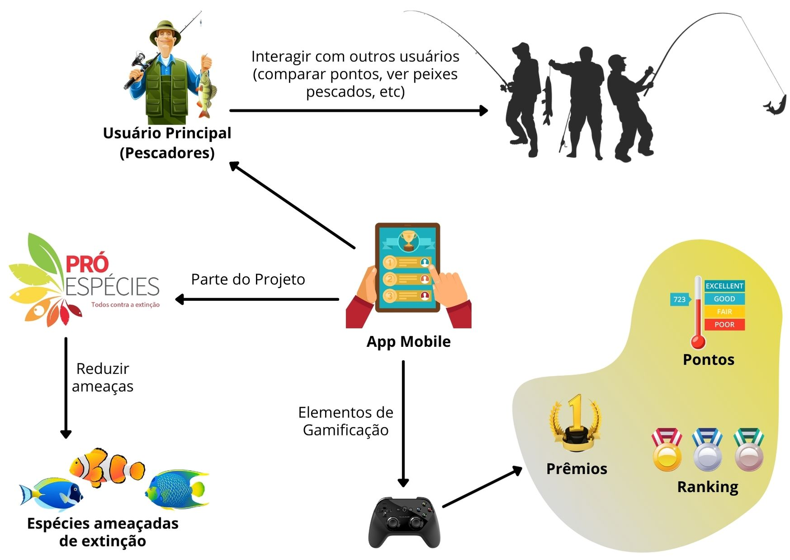

# Rich Picture

#### Histórico de revisões
|   Data   |  Versão  |        Descrição       |          Autor(es)          |
|:--------:|:--------:|:----------------------:|:---------------------------:|
|24/02/2021|   0.1    | Iniciando o documento e adicionando RP1 |  Weiller Fernandes  |

## 1. Introdução

As rich pictures fornecem um mecanismo para aprender sobre problemas complexos ou mal definidos, desenhando representações detalhadas deles. Normalmente, as rich pictures não seguem uma sintaxe comum, geralmente consistem em símbolos, esboços ou "rabiscos" e podem conter tantas informações quantas forem necessárias. A imagem finalizada pode ser valiosa para outras partes interessadas no problema descrito, uma vez que é provável que capture muitas facetas diferentes da situação, mas o valor real desta técnica é a maneira como força o criador a pensar mais profundamente sobre o problema e compreendê-lo bem o suficiente para expressá-lo pictoricamente (um processo conhecido como aprendizagem pela ação) [1].

A ideia da aplicação das rich pictures no atual projeto surgiu como uma forma de simplificar a comunicação entre a equipe de desenvolvimento e o cliente. O fato do cliente já fazer parte do Projeto Pró-Espécies permite que ele transmita todo o conhecimento necessário para que a equipe de desenvolvimento seja capaz de criar o aplicativo, assim como a equipe também é capaz de realizar o processo de engenharia de requisitos junto ao cliente, porém o uso das rich pictures facilita essa comunicação pois exclui a necessidade do uso de termos técnicos que poderiam mais atrapalhar do que auxiliar nessa etapa inicial do projeto.

## 2. Rich Picture

**Versão 1**

Autor: Weiller Fernandes

## Referências

[1] https://en.wikipedia.org/wiki/Rich_picture
